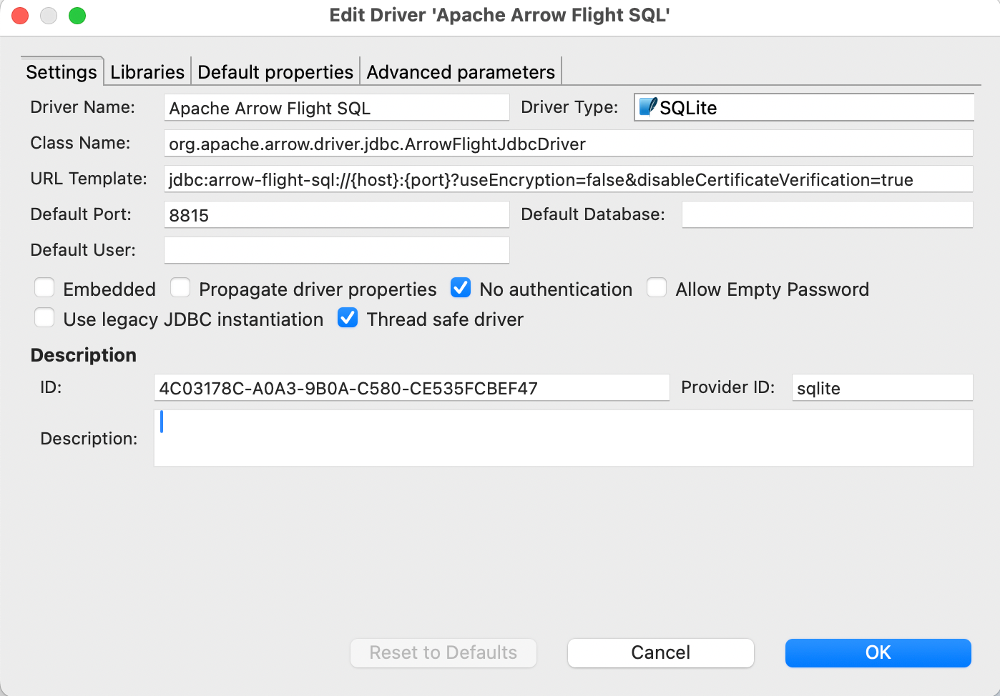
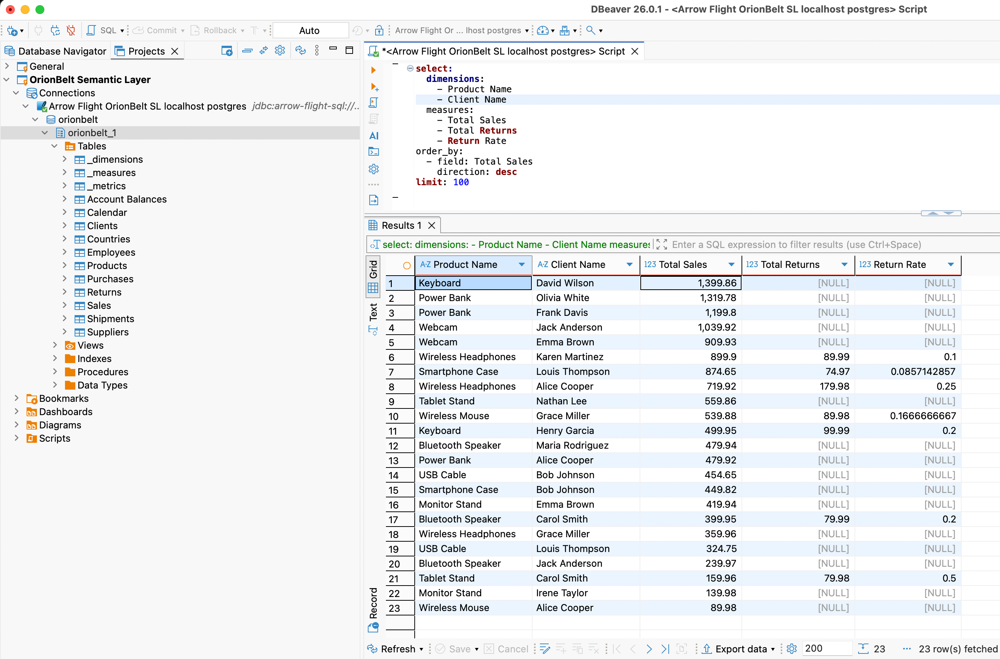
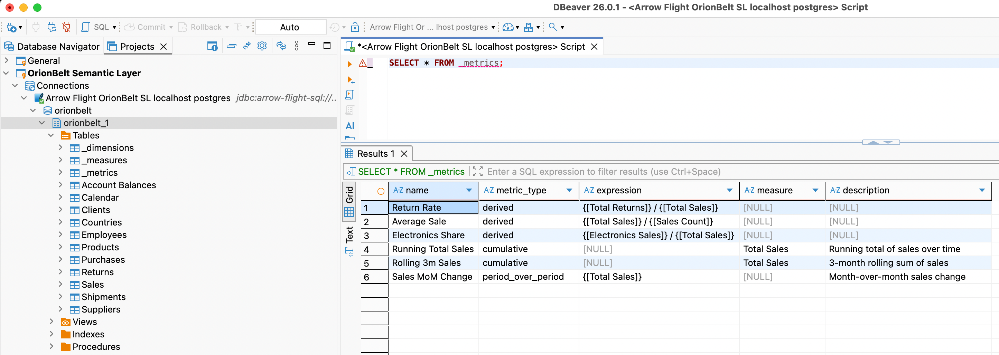

# DB-API 2.0 Drivers & Arrow Flight SQL

OrionBelt provides PEP 249 DB-API 2.0 drivers for 8 databases and an Arrow Flight SQL server extension that enables BI tools like DBeaver, Tableau, and Power BI to run OBML queries directly.

All drivers work against the **OrionBelt REST API in admin-curated mode** (`MODEL_FILES=<path>`). OBML queries are compiled transparently via `POST /v1/query/sql` — the user writes OBML, the driver returns SQL results.

## Package Overview

| Package               | Database                | Native Connector             | Dialect      | paramstyle | Arrow Support         |
| --------------------- | ----------------------- | ---------------------------- | ------------ | ---------- | --------------------- |
| `ob-driver-core`      | —                       | —                            | —            | —          | —                     |
| `ob-bigquery`         | BigQuery                | `google-cloud-bigquery`      | `bigquery`   | `pyformat` | `to_arrow()`          |
| `ob-duckdb`           | DuckDB                  | `duckdb`                     | `duckdb`     | `qmark`    | `fetch_arrow_table()` |
| `ob-postgres`         | PostgreSQL              | `adbc-driver-postgresql`     | `postgres`   | `qmark`    | ADBC native           |
| `ob-snowflake`        | Snowflake               | `snowflake-connector-python` | `snowflake`  | `pyformat` | `fetch_arrow_all()`   |
| `ob-clickhouse`       | ClickHouse              | `clickhouse-connect`         | `clickhouse` | `pyformat` | `query_arrow()`       |
| `ob-dremio`           | Dremio                  | `pyarrow.flight`             | `dremio`     | `qmark`    | Flight native         |
| `ob-databricks`       | Databricks              | `databricks-sql-connector`   | `databricks` | `pyformat` | `fetchall_arrow()`    |
| `ob-flight-extension` | Arrow Flight SQL server | `pyarrow.flight`             | all          | —          | —                     |

`ob-driver-core` is the shared foundation — PEP 249 exceptions, type codes, OBML detection, and the REST compilation bridge. All vendor drivers depend on it.

## How Drivers Work

```
Your Python App               OrionBelt API           Database
┌───────────────┐   HTTP      ┌───────────────┐
│ import ob_*   │ ─────────►  │ /v1/query/sql │  OBML → SQL
│               │ ◄─────────  │ (MODEL_FILES) │
│ cursor        │             └───────────────┘
│  .execute()   │   native protocol
│  .fetchall()  │ ─────────────────────────────► Snowflake / PG / ...
└───────────────┘
```

1. `cur.execute(query)` checks if the query is OBML (starts with `select:` + has `dimensions`/`measures`)
2. If OBML: sends `POST /v1/query/sql?dialect=<vendor>` to the API, gets back compiled SQL
3. Executes the compiled SQL on the database via the native connector
4. Plain SQL queries bypass the API entirely

## Prerequisites

The OrionBelt REST API must be running with at least one model preloaded:

```bash
# Multi-model (preferred): name each model with the OBML `name:` field
MODEL_FILES=models/sales.obml.yaml,models/marketing.obml.yaml uv run orionbelt-api
```

The driver picks a model via the `database` parameter (matches the OBML `name:`). With a single file loaded, the `/v1/query/sql` shortcut auto-resolves it without a `database` hint.

## Usage Examples

### DuckDB (in-process, no server needed)

```python
import ob_duckdb

conn = ob_duckdb.connect(database=":memory:")
with conn.cursor() as cur:
    # OBML query — compiled via API, executed on DuckDB
    cur.execute("""
select:
  dimensions:
    - Region
  measures:
    - Revenue
limit: 10
""")
    print(cur.fetchall())

    # Plain SQL — executed directly, no API call
    cur.execute("SELECT * FROM orders LIMIT 5")
    print(cur.fetchall())
```

### PostgreSQL

```python
import ob_postgres

conn = ob_postgres.connect(
    host="db.example.com",
    port=5432,
    dbname="analytics",
    user="app",
    password="secret",
)
with conn.cursor() as cur:
    cur.execute("""
select:
  dimensions:
    - Country
  measures:
    - Revenue
    - Order Count
""")
    for row in cur:
        print(row)
```

### Snowflake

```python
import ob_snowflake

conn = ob_snowflake.connect(
    account="xy12345",
    user="svc_orionbelt",
    password="secret",
    database="ANALYTICS",
    schema="PUBLIC",
    warehouse="COMPUTE_WH",
)
with conn.cursor() as cur:
    cur.execute("select:\n  measures:\n    - Revenue\n")
    print(cur.fetchone())
```

### ClickHouse

```python
import ob_clickhouse

conn = ob_clickhouse.connect(
    host="clickhouse.example.com",
    port=8123,
    username="default",
    password="secret",
    database="analytics",
)
with conn.cursor() as cur:
    cur.execute("select:\n  dimensions:\n    - Region\n  measures:\n    - Revenue\n")
    print(cur.fetchall())
```

### Databricks

```python
import ob_databricks

conn = ob_databricks.connect(
    server_hostname="adb-1234567890.azuredatabricks.net",
    http_path="/sql/1.0/warehouses/abc123",
    access_token="dapi...",
    catalog="hive_metastore",
    schema="default",
)
with conn.cursor() as cur:
    cur.execute("select:\n  dimensions:\n    - Region\n  measures:\n    - Revenue\n")
    print(cur.fetchall())
```

### Dremio

```python
import ob_dremio

conn = ob_dremio.connect(
    host="dremio.example.com",
    port=32010,
    username="user",
    password="secret",
    tls=True,
)
with conn.cursor() as cur:
    cur.execute("select:\n  dimensions:\n    - Region\n  measures:\n    - Revenue\n")
    print(cur.fetchall())
```

### Custom API URL

All drivers default to `http://localhost:8000`. Override with `ob_api_url`:

```python
conn = ob_duckdb.connect(ob_api_url="http://my-api:9000")
```

## connect() Parameters

### Common OrionBelt parameters (all drivers)

| Parameter    | Default                 | Description                                 |
| ------------ | ----------------------- | ------------------------------------------- |
| `ob_api_url` | `http://localhost:8000` | OrionBelt REST API URL                      |
| `ob_timeout` | `30`                    | HTTP timeout (seconds) for OBML compilation |

### Vendor-specific parameters

| Driver          | Parameters                                                                                |
| --------------- | ----------------------------------------------------------------------------------------- |
| `ob-duckdb`     | `database` (`:memory:`), `read_only`, `config`                                            |
| `ob-postgres`   | `dsn`, `host`, `port`, `dbname`, `user`, `password`, `sslmode`                            |
| `ob-snowflake`  | `account`, `user`, `password`, `database`, `schema`, `warehouse`, `role`, `authenticator` |
| `ob-clickhouse` | `host`, `port`, `username`, `password`, `database`, `secure`                              |
| `ob-dremio`     | `host`, `port`, `username`, `password`, `tls`                                             |
| `ob-databricks` | `server_hostname`, `http_path`, `access_token`, `catalog`, `schema`                       |

## Running Driver Tests

Drivers are workspace packages. Tests run without external services — all native connectors and the REST API are mocked:

```bash
# Individual driver
uv run --package ob-duckdb --with pytest python -m pytest drivers/ob-duckdb/tests/ -v

# All drivers
for pkg in ob-driver-core ob-bigquery ob-duckdb ob-postgres ob-snowflake ob-clickhouse ob-dremio ob-databricks ob-flight-extension; do
  echo "=== $pkg ==="
  uv run --package $pkg --with pytest python -m pytest drivers/$pkg/tests/ -v
done
```

---

## Arrow Flight SQL Server

The `ob-flight-extension` package adds an Arrow Flight SQL endpoint to the OrionBelt API. This enables BI tools that support the Arrow Flight protocol — DBeaver, Tableau (via JDBC), Power BI (via ODBC bridge) — to run OBML queries directly.

### Architecture

```
DBeaver / Tableau / Power BI
        │ Arrow Flight (gRPC, port 8815)
        ▼
┌────────────────────────────────┐
│  OrionBelt API                 │
│  ├── REST API  (:8080)         │  FastAPI endpoints
│  └── Flight SQL (:8815)        │  Arrow Flight server (daemon thread)
│        ├── OBML detection      │
│        ├── CompilationPipeline │  (direct, no HTTP hop)
│        └── Vendor driver       │  executes compiled SQL
└────────────┬───────────────────┘
             │ outbound TCP/HTTPS
             ▼
   Snowflake / PostgreSQL / ClickHouse / Databricks / Dremio / DuckDB
   (cloud or on-premise, wherever the database is)
```

The Flight server runs **inside** the API process as a daemon thread — it uses the `CompilationPipeline` directly (no REST call for compilation) and executes queries via the OB vendor drivers.

### Configuration

All settings are in `.env` (or environment variables). Pydantic-settings reads them automatically.

```env
# .env

# --- Core API (unchanged) ---
MODEL_FILES=models/sales.obml.yaml
API_SERVER_PORT=8000
LOG_LEVEL=INFO

# --- Arrow Flight SQL ---
FLIGHT_ENABLED=true
FLIGHT_PORT=8815
FLIGHT_AUTH_MODE=none          # "none" or "token"
# FLIGHT_API_TOKEN=changeme   # required when FLIGHT_AUTH_MODE=token

# --- Database vendor ---
DB_VENDOR=postgres             # which driver to use for query execution

# --- Vendor credentials (match DB_VENDOR) ---
POSTGRES_HOST=db.example.com
POSTGRES_PORT=5432
POSTGRES_DBNAME=analytics
POSTGRES_USER=app
POSTGRES_PASSWORD=secret
```

### Settings Reference

| Variable           | Default  | Description                               |
| ------------------ | -------- | ----------------------------------------- |
| `FLIGHT_ENABLED`   | `false`  | Enable the Flight SQL server              |
| `FLIGHT_PORT`      | `8815`   | gRPC listen port                          |
| `FLIGHT_AUTH_MODE` | `none`   | `none` (open) or `token` (static bearer)  |
| `FLIGHT_API_TOKEN` | —        | Required when `FLIGHT_AUTH_MODE=token`    |
| `DB_VENDOR`        | `duckdb` | Default vendor driver for query execution |

### DB_VENDOR and Credentials

`DB_VENDOR` selects which database driver the Flight server uses to execute compiled SQL:

| DB_VENDOR    | Driver        | Credential Environment Variables                                                                                             |
| ------------ | ------------- | ---------------------------------------------------------------------------------------------------------------------------- |
| `duckdb`     | ob-duckdb     | `DUCKDB_DATABASE`                                                                                                            |
| `postgres`   | ob-postgres   | `POSTGRES_HOST`, `POSTGRES_PORT`, `POSTGRES_DBNAME`, `POSTGRES_USER`, `POSTGRES_PASSWORD`                                    |
| `snowflake`  | ob-snowflake  | `SNOWFLAKE_ACCOUNT`, `SNOWFLAKE_USER`, `SNOWFLAKE_PASSWORD`, `SNOWFLAKE_DATABASE`, `SNOWFLAKE_SCHEMA`, `SNOWFLAKE_WAREHOUSE` |
| `clickhouse` | ob-clickhouse | `CLICKHOUSE_HOST`, `CLICKHOUSE_PORT`, `CLICKHOUSE_USERNAME`, `CLICKHOUSE_PASSWORD`, `CLICKHOUSE_DATABASE`                    |
| `dremio`     | ob-dremio     | `DREMIO_HOST`, `DREMIO_PORT`, `DREMIO_USERNAME`, `DREMIO_PASSWORD`                                                           |
| `databricks` | ob-databricks | `DATABRICKS_SERVER_HOSTNAME`, `DATABRICKS_HTTP_PATH`, `DATABRICKS_ACCESS_TOKEN`                                              |

### Running Locally

```bash
uv sync

# Start API + Flight SQL
FLIGHT_ENABLED=true MODEL_FILES=models/sales.obml.yaml uv run orionbelt-api
```

Or with a `.env` file:

```bash
uv sync
uv run orionbelt-api
# reads FLIGHT_ENABLED=true from .env
```

### Docker

Use `Dockerfile.flight` for on-premise deployments with Flight SQL enabled:

```bash
# Build
docker build -f Dockerfile.flight -t orionbelt-flight .

# Run with .env file
docker run -p 8080:8080 -p 8815:8815 \
  --env-file .env \
  -v ./models:/models:ro \
  orionbelt-flight
```

Or with explicit environment variables:

```bash
docker run -p 8080:8080 -p 8815:8815 \
  -e MODEL_FILES=/models/sales.obml.yaml \
  -e FLIGHT_ENABLED=true \
  -e DB_VENDOR=snowflake \
  -e SNOWFLAKE_ACCOUNT=xy12345 \
  -e SNOWFLAKE_USER=svc_orionbelt \
  -e SNOWFLAKE_PASSWORD=secret \
  -e SNOWFLAKE_DATABASE=ANALYTICS \
  -e SNOWFLAKE_SCHEMA=PUBLIC \
  -e SNOWFLAKE_WAREHOUSE=COMPUTE_WH \
  -v ./models:/models:ro \
  orionbelt-flight
```

The container makes **outbound** connections to the database — no extra port mapping needed for that. Works with cloud databases (Snowflake, Databricks, etc.) out of the box.

### Docker Compose

```yaml
services:
  orionbelt:
    build:
      dockerfile: Dockerfile.flight
    ports:
      - "8080:8080" # REST API
      - "8815:8815" # Flight SQL
    env_file: .env
    volumes:
      - ./models:/models:ro
    restart: unless-stopped

  # Optional: local PostgreSQL for development
  postgres:
    image: postgres:16
    environment:
      POSTGRES_DB: analytics
      POSTGRES_USER: app
      POSTGRES_PASSWORD: secret
    ports:
      - "5432:5432"
```

With `.env`:

```env
MODEL_FILES=/models/sales.obml.yaml
FLIGHT_ENABLED=true
DB_VENDOR=postgres
POSTGRES_HOST=postgres
POSTGRES_PORT=5432
POSTGRES_DBNAME=analytics
POSTGRES_USER=app
POSTGRES_PASSWORD=secret
```

### Cloud Run

The Flight extension is **not needed** for Cloud Run deployments. Cloud Run uses the original `Dockerfile` (REST API only). The Flight SQL server is designed for on-premise or hybrid deployments where BI tools need direct database access via Arrow Flight.

### DBeaver Setup

1. **Download** the [Arrow Flight SQL JDBC driver](https://central.sonatype.com/artifact/org.apache.arrow/flight-sql-jdbc-driver) JAR (19.0.0 or newer) and install in Driver Manager:

<p align="center">
  
</p>

2. **New Connection** > Apache Arrow Flight SQL
3. **Host:** your Docker host IP or `localhost`
4. **Port:** `8815`
5. **Database** (multi-model only): the model name (one of `GET /v1/models`). Leave empty in single-model mode — auto-resolve picks the only loaded model. The driver maps this field to the gRPC `database` metadata header.
6. **Authentication:** leave empty (or use token if `FLIGHT_AUTH_MODE=token`)
7. **Test Connection** > should show "Connected", `Server: OrionBelt Semantic Layer`, and the driver version.
8. In the SQL editor, write [OrionBelt Semantic QL](guide/semantic-ql.md):

```sql
-- aggregate, FROM the model's virtual table (or omit FROM entirely)
SELECT "Region", "Total Sales"
FROM   sales
WHERE  "Year" = 2025
ORDER  BY "Total Sales" DESC
LIMIT  100

-- hierarchical subtotals
SELECT "Region", "Country", "Total Sales"
FROM   sales
WITH ROLLUP

-- detail rows (raw mode) via qualified `"DataObject"."column"` refs
SELECT "Customers"."Customer Name", "Customers"."Country"
FROM   sales
LIMIT  100
```

Each loaded model appears in the schema browser as its own schema
(`orionbelt.<model_name>`) containing a virtual table named `model`
(columns = all dimensions + measures + metrics) and six introspection
views: `dimensions` / `measures` / `metrics` for BI-tool picker side
panels (one column per label) and `_dimensions_metadata` /
`_measures_metadata` / `_metrics_metadata` for full attribute rows
(name, data object, type, time grain, description, …). `SHOW TABLES`,
`DESCRIBE`, `information_schema.*`, and `pg_catalog.*` queries are
answered from the model and never touch the warehouse.

<p align="center">
  
</p>

You can also query the virtual OBML tables:

<p align="center">
  
</p>

#### Troubleshooting

| Symptom | Fix |
|---|---|
| **"Cannot cast GenericDataSource to SQLiteDataSource"** | DBeaver workspace stored the connection with the wrong provider (often after a DBeaver upgrade). Delete the connection and recreate it from scratch via *Database → New Database Connection → Apache Arrow Flight SQL*. Don't edit the workspace JSON in place. |
| **"No suitable driver found for jdbc:arrow-flight-sql://..."** | The Arrow Flight SQL driver lost its class registration. *Database → Driver Manager → Apache Arrow Flight SQL → Edit → Libraries* → re-download the JAR (19.0.0+), then use *Find Class* to re-register `org.apache.arrow.driver.jdbc.ArrowFlightJdbcDriver`. |
| **`Server: ?` in the connection-test dialog** | Server is on an older OBSL build that didn't populate `CommandGetSqlInfo`. Upgrade to v2.4.0+ — DBeaver will then show `Server: OrionBelt Semantic Layer`. |
| **`[NO_MODEL_SELECTED]` on connect** | Multiple models are loaded and you didn't set *Database*. Either set it to one of the names from `GET /v1/models`, or restart the server with a single model. |
| **`[RAW_SQL_REJECTED]` on a query you think is valid** | OBSL is a semantic layer — `SELECT * FROM <physical_table>` is rejected by design. Use the model's virtual table name (or omit `FROM`) and reference dim/measure labels. There is no flag to enable raw SQL. |
| **Smoke-test without DBeaver** | Run `uv run python examples/obsql.py 'SELECT version()'` — same Flight surface, no GUI dependencies. |

### Tableau Setup

1. Download the [Arrow Flight SQL JDBC driver](https://central.sonatype.com/artifact/org.apache.arrow/flight-sql-jdbc-driver) JAR
2. **Connect** > Other Databases (JDBC)
3. **URL:** `jdbc:arrow-flight-sql://host:8815?useEncryption=false`
4. Use Custom SQL with OBML query or plain SQL
