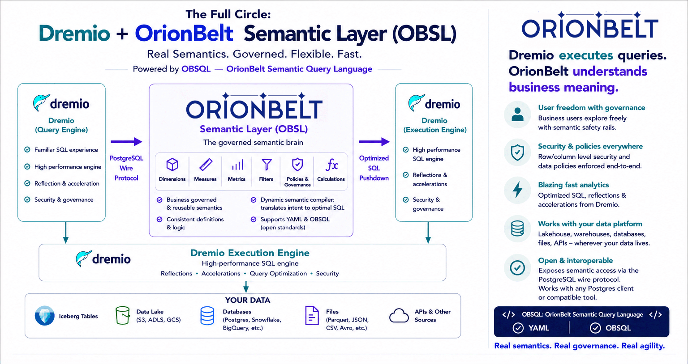

# Connecting BI tools via the Postgres wire surface

OrionBelt's Postgres wire surface (`PGWIRE_ENABLED=true`) lets any
Postgres-compatible client query a loaded OBSL model — without
installing a custom JDBC driver, ODBC bridge, or Arrow Flight client.
Most BI tools ship a built-in Postgres connector that "just works".

This page is a step-by-step manual checklist for the four tools
covered by Step 5 of the
[Postgres wire plan](https://github.com/ralfbecher/orionbelt-semantic-layer/blob/main/design/PLAN_postgres_wire.md):
DBeaver, Tableau Desktop, Power BI Desktop, and Metabase.

## The Semantic Loop — Dremio + OrionBelt



Dremio is the flagship pgwire consumer in v2.5: register OBSL as a
Postgres source, and Dremio's federation engine pushes queries down
over the wire. With a Dremio-backed OBSL model (OBML
``settings.defaultDialect: dremio``) the loop closes — Dremio
queries OBSL via Postgres, OBSL compiles to Dremio's SQL dialect,
ob-dremio's Arrow Flight driver streams the result back through
Dremio's own execution engine. Governed semantics, no extra hop.

## 1. Common configuration

Start the OBSL server with the wire surface enabled:

```bash
DB_VENDOR=duckdb \
DUCKDB_DATABASE=examples/orionbelt_1_commerce.duckdb \
QUERY_EXECUTE=true \
PGWIRE_ENABLED=true \
PGWIRE_PORT=5432 \
MODEL_FILES=examples/orionbelt_1_commerce.yaml \
uv run orionbelt-api
```

Every client uses the same connection details:

| Setting | Value |
|---|---|
| Host | the machine running `orionbelt-api` (`localhost` for local dev) |
| Port | `PGWIRE_PORT` (default `5432`) |
| Database | the model addressing name — the OBML `name:` field or, lacking that, the file stem (e.g. `orionbelt_1_commerce`) |
| Username | any non-empty string (`obsl`, the tool's default — ignored in `trust` mode) |
| Password | leave empty in `trust` mode (auth lands in Step 6) |
| TLS / SSL | disable; the server has no built-in TLS today |

To list available model names, query the REST `GET /v1/models`
endpoint or check the server startup log.

## 2. DBeaver

DBeaver Community speaks pgwire natively via its bundled PostgreSQL
JDBC driver.

1. **New Connection → PostgreSQL.** Fill in host, port, database
   (the model name), username `obsl`, no password.
2. **Driver properties → `sslmode = disable`.** OBSL doesn't ship TLS;
   the default `sslmode=prefer` will silently fall back.
3. **Test connection.** DBeaver issues a flurry of pg_catalog probes
   immediately. Expect success.
4. **Schema browser → "main" schema → Tables.** You should see one
   entry per loaded model. Right-click → "View data" returns rows.
5. **SQL editor.** Try:

    ```sql
    SELECT "Sales Year", "Total Sales"
    FROM orionbelt_1_commerce
    LIMIT 10;
    ```

| Behaviour | Expected |
|---|---|
| Schema tree populates | ✅ |
| Column types displayed correctly | ✅ (via `information_schema.columns`) |
| Bind-parameterised query (DBeaver "Generate SELECT * LIMIT 100") | ✅ (extended-query protocol, Step 4) |
| `\d`-style metadata dialog | ⚠ partial — DBeaver may fall back to information_schema (works) |

## 3. Tableau Desktop

Tableau's PostgreSQL connector lives under **Connect → To a Server →
PostgreSQL**.

1. Enter the connection details from §1.
2. Tableau may probe `pg_catalog.pg_class` and `information_schema.tables`
   at connect time — these are answered by the catalog emulator.
3. Once connected, drag the model table from the left panel onto the
   canvas to use it as a data source.
4. Drag a dimension (e.g. `Sales Year`) to *Rows* and a measure
   (e.g. `Total Sales`) to *Columns*. A bar chart renders.

| Behaviour | Expected |
|---|---|
| Connect succeeds | ✅ |
| Table list populates | ✅ |
| Live (non-extract) data refresh | ✅ |
| Custom SQL with parameters | ⚠ depends on the SQL — only `SELECT dim, measure FROM model` shapes round-trip |

## 4. Power BI Desktop (Windows only)

1. **Get Data → PostgreSQL database.** Server: `host:port`. Database:
   the model name.
2. Authentication: **Database** tab, leave password empty.
3. After connecting, the Navigator shows the model table. Tick it and
   load.
4. Build a visual — drag the dimension and measure onto a chart.

Power BI defaults to *Import* mode. *DirectQuery* will run live
queries through pgwire on every interaction — works, but every chart
becomes a network round-trip.

## 5. Metabase

Self-hosted Metabase ships a Postgres connector.

1. **Admin → Databases → Add database → PostgreSQL.**
2. Fill in the connection details from §1. Leave SSL disabled.
3. Metabase scans `information_schema` at connect time to populate the
   "Data Reference" panel.
4. Build a Question via the GUI — the table appears under the
   database; pick a dimension + measure aggregation. Metabase
   generates `SELECT "Dimension", AGG("Measure") FROM table GROUP BY 1`,
   which OBSL routes through OBSQL.

| Behaviour | Expected |
|---|---|
| Database scan succeeds | ✅ |
| Question builder lists columns | ✅ |
| Aggregation queries return rows | ✅ |
| Custom-SQL questions with raw SQL | ⚠ only OBSL-shaped SQL works |

## 6. Dremio SQL Runner — catalog flip & Calcite quirks

Dremio is a federated query engine, not a passive Postgres client: every
query you write in its SQL Runner is parsed and validated by Apache
Calcite before any pushdown to OBSL. That introduces two shape
constraints that tools connecting directly to pgwire (DBeaver, Tableau,
psql) never hit.

### Address the model as `<schema>."model"`

The v2.5 pgwire catalog layout is
`database=<source>, schema=<model_name>, table=model`. Dremio's catalog
reflection sees `<model_name>` as a **schema (CONTAINER)** — you cannot
write `FROM <model_name>` in Dremio because Calcite will not bind a
`FROM` clause to a schema. The pgwire surface exposes a special `model`
view in each schema that routes through OBSQL — that's the queryable
dataset.

```sql
-- ❌ wrong: Dremio resolves the schema, not a table
SELECT "Country Name", "Total Sales"
  FROM obsl_pg.orionbelt_1_commerce;
-- Error: Object 'obsl_pg.orionbelt_1_commerce' not found

-- ✅ right: 3-part name with the magic "model" table
SELECT "Country Name", "Total Sales"
  FROM obsl_pg.orionbelt_1_commerce."model";
```

Tools that connect direct to pgwire (`localhost:5432`, no Dremio in the
middle) accept the bare model name because they do not pre-validate
against pg_class — the bare name is unwrapped server-side. The 3-part
form also works direct, so it's the portable shape.

### Calcite ROLLUP / CUBE syntax, not MySQL `WITH ROLLUP`

OBSL's pgwire accepts both MySQL trailing `... WITH ROLLUP` and standard
`GROUP BY ROLLUP(...)`. Calcite only knows the standard form, so through
Dremio:

```sql
-- ❌ MySQL syntax — Calcite parser error
GROUP BY "Country Name" WITH ROLLUP

-- ✅ Calcite-standard
GROUP BY ROLLUP("Country Name")
GROUP BY CUBE("Country Name", "Sales Year")
GROUP BY GROUPING SETS (("Country Name"), ("Sales Year"), ())
```

### Aggregation through Dremio: what actually works

Calcite enforces "expression must be aggregated or appear in GROUP BY"
whenever there is a `GROUP BY`. OBSL measures arrive on the wire as
**already-aggregated values**, so OBSL refuses any wrapping aggregate
that would *change* the measure's declared math. The supported shims
are:

| OBSL accepts | Meaning |
|---|---|
| Bare measure label | Works **only without `GROUP BY`** — Dremio pushes the SELECT down whole, OBSL applies the OBML `aggregation:` server-side |
| Wrapping aggregate that **matches** the measure's declared agg | e.g. `SUM("Total Sales")` on a `sum:`-declared measure, `COUNT(DISTINCT "Sales Order Count")` on a `count_distinct:`-declared measure |
| `MEASURE("<label>")` | The portable semantic shim — but **Calcite has no `MEASURE()` operator** ([CALCITE-4496](https://issues.apache.org/jira/browse/CALCITE-4496)), so Dremio rejects it before it reaches the wire |

Calcite also **rewrites** several aggregates into subqueries that OBSL
does not support — `AVG(x)` → `SUM(x)/COUNT(x)`, `COUNT(DISTINCT x)` →
correlated subquery — so even the "matching wrapper" pattern often
fails to pass through Dremio cleanly. In practice this means:

| Through Dremio | Result |
|---|---|
| Bare measure, no `GROUP BY` | ✅ works for **any** aggregation type |
| `SUM(<sum-declared measure>)` with `GROUP BY` / `ROLLUP` / `CUBE` | ✅ wrapper accepted; OBML aggregation applied |
| `SUM(<non-sum measure>)` with `GROUP BY` | ❌ OBSL: *"Measure `…` is declared as `…` — applying `SUM` would change its math"* |
| `COUNT(DISTINCT <count-distinct measure>)` | ❌ Dremio rewrites as subquery → OBSL: *"Subqueries not supported"* |
| `AVG(<any measure>)` | ❌ Dremio rewrites as `SUM/COUNT` subqueries |
| `MEASURE(<any measure>)` | ❌ Calcite: *"No match found for function signature MEASURE(…)"* |
| `COUNT(*)` | ❌ OBSL: *"Aggregate `COUNT(*)` must wrap a single measure label"* |

```sql
-- ✅ Bare label — works for any measure, no GROUP BY:
SELECT "Country Name", "Sales Order Count", "Total Sales"
  FROM obsl_pg.orionbelt_1_commerce."model"
  LIMIT 10;

-- ✅ SUM-wrap on a sum-declared measure, with grouping:
SELECT "Country Name", SUM("Total Sales") AS sales
  FROM obsl_pg.orionbelt_1_commerce."model"
  GROUP BY ROLLUP("Country Name");
```

### Working around the AVG / COUNT_DISTINCT gap through Dremio

If you need an averaged or count-distinct measure **with `GROUP BY`** in
Dremio, three options:

1. **Skip Dremio for the measure query** — point the BI tool directly at
   OBSL pgwire (`:5432`). Bare measure labels work in `GROUP BY` /
   `ROLLUP` / `HAVING` because OBSL parses the SQL itself; the
   Calcite-imposed "wrap or group" rule never applies.
2. **Express the average as a sum-decomposed derived metric in OBML.**
   `expression: '{[Total Sales]} / {[Sales Order Count]}'` — both inputs
   are SUM/COUNT-style measures, the metric inherits the
   `aggregation: sum` shim path, and through Dremio you wrap the metric
   in `SUM(...)` like any other additive measure.
3. **Wait for Calcite `MEASURE()` support to land in Dremio** — Calcite
   has parser tokens for SQL:2023 `MEASURE` / `AGG()` but no
   implementation. Until [CALCITE-4496](https://issues.apache.org/jira/browse/CALCITE-4496)
   ships and Dremio picks it up, semantic-aware aggregation through
   Calcite is blocked upstream.

## Known limitations

These constraints are documented in
[design/PLAN_postgres_wire.md §10](https://github.com/ralfbecher/orionbelt-semantic-layer/blob/main/design/PLAN_postgres_wire.md):

| Limitation | Reason | Workaround |
|---|---|---|
| `psql \d <table>` partially works (psql 16 RLS-policy probe hits DuckDB's correlated-UNNEST limit) | DuckDB engine, not the wire protocol | Use BI tools (they query `information_schema`) or `\dt` |
| Binary-format Bind parameters rejected | Step 4 ships text format only | Force text format if a driver supports it; binary lands in Step 7 |
| No authentication | `trust` mode only until Step 6 lands | Run behind a network boundary or skip pgwire on public deploys |
| No TLS | Native TLS comes in a later step | Front with nginx / Cloud Run TLS termination |
| Write operations (`INSERT` / `UPDATE` / `DELETE` / DDL) | Read-only semantic layer | Use the REST API for model management; data writes go to the warehouse, not OBSL |

## Reporting a tool that fails

Catalog probes that OBSL doesn't understand log a single warning per
unique SQL shape:

```
WARNING ... PGWIRE_CATALOG_PROBE_UNHANDLED dialect=duckdb error=...
```

If a BI tool fails to connect, scrape that line out of the server log
and open an issue against
[orionbelt-semantic-layer](https://github.com/ralfbecher/orionbelt-semantic-layer/issues)
with the captured SQL. We extend the catalog rewriter (see
`src/orionbelt/pgwire/catalog.py`) per-tool until it lights up.
