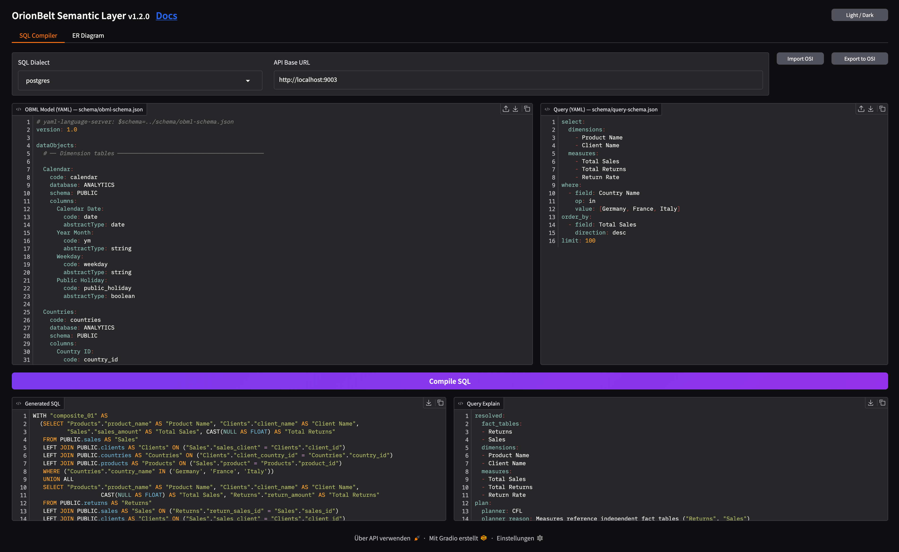

# Gradio UI

OrionBelt includes an interactive web UI built with [Gradio](https://www.gradio.app/) for exploring and testing the compilation pipeline visually.

## Features

- **Side-by-side editors** — OBML model (YAML) and query (YAML) with syntax highlighting
- **Dialect selector** — Switch between all 8 supported SQL dialects
- **One-click compilation** — Compile button generates formatted SQL output
- **SQL validation feedback** — Warnings and validation errors from sqlglot are displayed as comments above the generated SQL
- **Query execution** — Execute compiled queries against a connected database with locale-aware number formatting, right-aligned numeric columns, TSV download, and clipboard copy (results are fetched over the Arrow transport)
- **Interactive results** — Click a dimension value to add a `WHERE` filter, a measure/metric value to add a `HAVING` filter, or a null dimension cell to add an `IS NULL` filter; filters are additive and toggle off on re-click, with a Clear-filters button that leaves query-defined filters enforced. Per-column headers run server-side `ORDER BY` (ascending / descending / clear). Every interaction rewrites the query YAML and re-executes
- **Jump-to navigator** — Scroll the model editor to any section or artefact (dataObject, dimension, measure, metric, ...) from a filterable dropdown
- **Response metadata** — Collapsible panel showing execution metadata as YAML: dialect, row count, timing, timezone, column types and format patterns, and resolved query plan (fact tables, dimensions, measures)
- **ER Diagram tab** — Visualize the semantic model as a Mermaid ER diagram with left-to-right layout, FK annotations, dotted lines for secondary joins, and an adjustable zoom slider
- **OSI Import / Export** — Import OSI format models (converted to OBML) and export OBML models to OSI format, with validation feedback
- **Dark / light mode** — Toggle via the header button; all inputs and UI state are persisted across mode switches

The bundled example model (`examples/sem-layer.obml.yml`) is loaded automatically on startup.




The ER diagram is also available as download (MD or PNG) or via the REST API.

## Local Development

For local development, the Gradio UI is automatically mounted at `/ui` on the REST API server:

```bash
uv sync
uv run orionbelt-api
# -> API at http://localhost:8000
# -> UI  at http://localhost:8000/ui
```

## Standalone Mode

The UI can also run as a separate process, connecting to the API via `API_BASE_URL`:

```bash
uv sync
uv run orionbelt-api                                    # API on :8000
uv run orionbelt-ui                                     # UI on :7860
API_BASE_URL=http://remote-api:8080 uv run orionbelt-ui # point to remote API
```

## Live Demo

The hosted demo is available at:

> **[https://orionbelt.ralforion.com/ui](https://orionbelt.ralforion.com/ui/?__theme=dark)**

API endpoint: `https://orionbelt.ralforion.com` — Interactive docs: [Swagger UI](https://orionbelt.ralforion.com/docs) | [ReDoc](https://orionbelt.ralforion.com/redoc)
