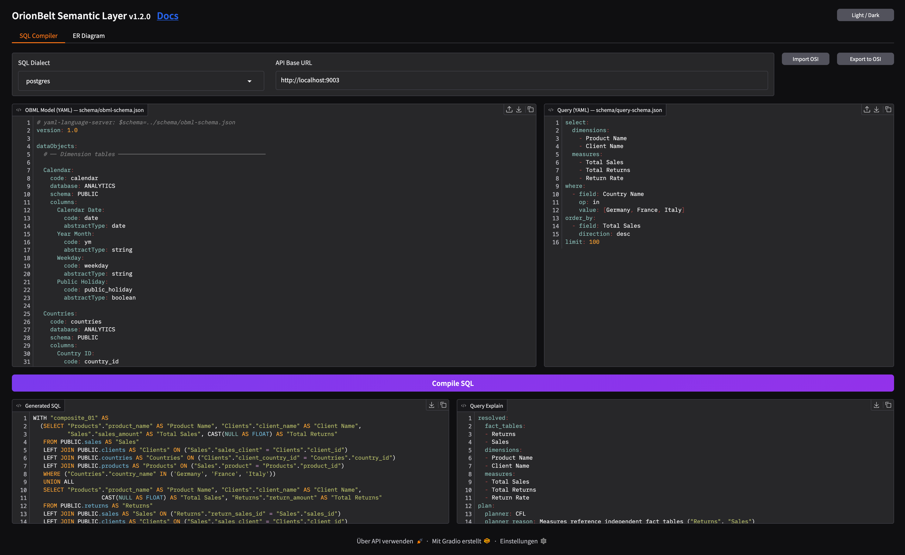
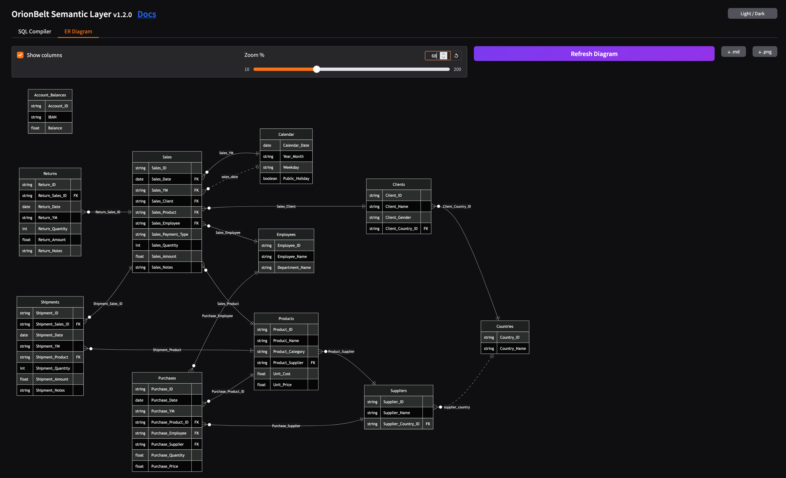
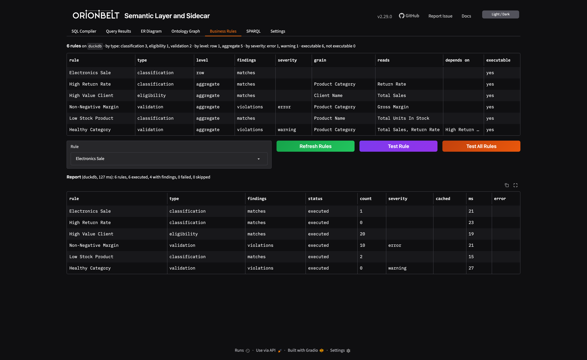
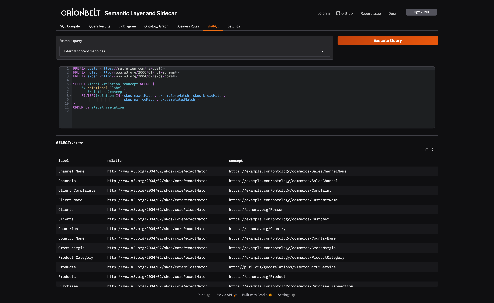

# Gradio UI

OrionBelt includes an interactive web UI built with [Gradio](https://www.gradio.app/) for exploring and testing the compilation pipeline visually.

## Features

- **Side-by-side editors** — OBML model (YAML) and query (YAML) with syntax highlighting
- **Dialect selector** — Switch between all 8 supported SQL dialects
- **One-click compilation** — Compile button generates formatted SQL output
- **SQL validation feedback** — Warnings and validation errors from sqlglot are displayed as comments above the generated SQL
- **Query execution** — Execute compiled queries against a connected database with locale-aware number formatting, right-aligned numeric columns, TSV download, and clipboard copy (results are fetched over the Arrow transport)
- **Interactive results** — Click a dimension value to add a `WHERE` filter, a measure/metric value to add a `HAVING` filter, or a null dimension cell to add an `IS NULL` filter; filters are additive and toggle off on re-click, with a Clear-filters button that leaves query-defined filters enforced. Per-column headers run server-side `ORDER BY` (ascending / descending / clear). Every interaction rewrites the query YAML and re-executes
- **Example queries** — A dropdown above the dimension / measure / column pickers lists the model's [`examples:`](model-format.md#examples); picking one replaces the query editor's content with that query, ready for Compile SQL or Execute Query. It is shown only when the loaded model declares examples, so the bundled demo model offers seven (ranking, client vs supplier country roles, multi-fact, month-over-month, running total, rollup, HAVING) and a model without examples looks as before
- **Jump-to navigator** — Scroll the model editor to any section or artefact (dataObject, dimension, measure, metric, ...) from a filterable dropdown
- **Response metadata** — Collapsible panel showing execution metadata as YAML: dialect, row count, timing, timezone, column types and format patterns, and resolved query plan (fact tables, dimensions, measures)
- **ER Diagram tab** — Visualize the semantic model as a Mermaid ER diagram with left-to-right layout, FK annotations, dotted lines for secondary joins, and an adjustable zoom slider
- **Lineage tab** — Draws what the current query, or a picked dimension, measure, metric or rule, is built from, down to the tables, as a Mermaid flowchart. *Lineage of* defaults to *Query*, which traces the query editor's query including the planner's joins; choosing another type fills the *Name* dropdown from the model. A zoom slider sizes the diagram, which scrolls both ways inside its box, and the diagram downloads as Mermaid Markdown (`.md`), PNG, or Turtle (`.ttl`, the OBSL graph's IRIs linked by `prov:wasDerivedFrom`). A multi-fact query shows the `UNION ALL` that combines its legs
- **Business Rules tab** — Lists the rules declared in the model's `rules:` block with statistics (by type, level, severity, executable), selects a rule by clicking its row, shows the selected rule's OBML definition on request (Show rule definition), tests that rule (its findings: members or violations) or all rules (a report with per-rule status, counts and errors); runs through the API's evaluate endpoints, so it needs query execution enabled
- **SPARQL tab** — Run read-only SPARQL (`SELECT` / `ASK`) over the loaded model's OBSL graph in an editor with SPARQL syntax highlighting, line numbers and folding (the vendored ACE editor, light and dark themes), with a gallery of ready-to-run examples (artefacts by type, measures and their columns, joins, external concept mappings and their provenance). `SELECT` bindings render as a table, `ASK` as a boolean; update operations are refused, as at the API
- **OSI Import / Export** — Import OSI format models (converted to OBML) and export OBML models to OSI format, with validation feedback
- **Dark / light mode** — Toggle via the header button; all inputs and UI state are persisted across mode switches

The bundled example model (`examples/orionbelt_1_commerce.yaml`) is loaded automatically on startup. It matches the seeded demo dataset, so its queries execute as well as compile.





The ER diagram is also available as download (MD or PNG) or via the REST API.



The Business Rules tab lists the model's rules with statistics; click a row to select a rule, Test Rule shows its findings, Test All Rules the report. See [Business Rules](business-rules.md).



The SPARQL tab runs read-only queries over the model's OBSL graph, with a gallery of examples and an editor with SPARQL highlighting. See [OBSL Graph & SPARQL](obsl.md).

## Local Development

For local development, the Gradio UI is automatically mounted at `/ui` on the REST API server:

```bash
uv sync
uv run orionbelt-api
# -> API at http://localhost:8000
# -> UI  at http://localhost:8000/ui
```

## Standalone Mode

The UI can also run as a separate process, connecting to the API via `API_BASE_URL`:

```bash
uv sync
uv run orionbelt-api                                    # API on :8000
uv run orionbelt-ui                                     # UI on :7860
API_BASE_URL=http://remote-api:8080 uv run orionbelt-ui # point to remote API
```

## Live Demo

The hosted demo is available at:

> **[https://orionbelt.ralforion.com/ui](https://orionbelt.ralforion.com/ui/?__theme=dark)**

API endpoint: `https://orionbelt.ralforion.com` — Interactive docs: [Swagger UI](https://orionbelt.ralforion.com/docs) | [ReDoc](https://orionbelt.ralforion.com/redoc)
